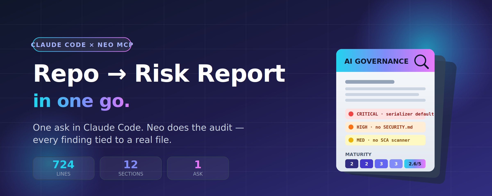
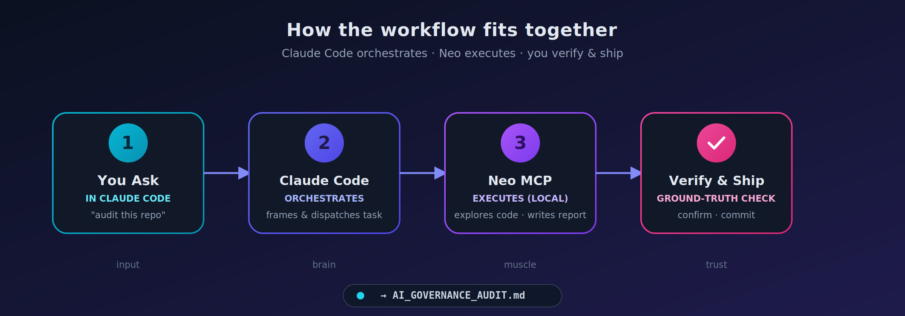

  

# We Asked Claude Code to Audit a Repo for AI Governance Risk — and It Used Neo MCP to Do It in One Go

> Sitting in Claude Code, we typed one request: *"audit this repo for AI governance risk."* Claude reached for its installed Neo MCP, handed off the heavy lifting, and minutes later we had a 724-line, board-ready report in the repo — every finding tied to an actual file.

*A walkthrough from inside the Claude Code session: what we asked, how Claude used Neo, what came back, and how you can wire up the same setup.*

**⏱ 6-min read · For:** engineering leads, AI risk owners, platform teams

---

## TL;DR

- We worked entirely **inside Claude Code** — the editor/agent you already know.
- We asked Claude to **audit the repo for AI governance risk**. Claude dispatched the deep work to **Neo through its installed MCP**.
- Neo explored the codebase on its own — serializers, checkpointers, CI/CD, dependency config — and wrote a **12-section, evidence-based report**.
- Every finding points to a **real file path**, not a vibe.
- The division of labor that makes it reliable: **Claude Code orchestrates and verifies; Neo executes.**

---

## The problem with AI governance audits

If you've ever sat through an AI governance review, you know the shape of the pain.

Someone has to read the codebase. Map the dependencies. Find where secrets live. Figure out how state is persisted. Check what the CI pipeline *actually* enforces. Then translate all of it into the language of risk — NIST AI RMF, ISO 42001, OECD principles, a maturity scorecard, an action plan.

It's days of work. It's expensive. And it almost always happens **after** something has already shipped.

So we tried something different — without ever leaving our editor:

> **From inside Claude Code, ask it to run a complete AI governance audit on a real codebase, and let it use Neo MCP to do the investigation.**

The target: [`langchain-ai/langgraph`](https://github.com/langchain-ai/langgraph), the orchestration framework behind a huge number of production agent systems. A monorepo. Eight Python packages. Checkpointers, serializers, a release pipeline. Exactly the kind of system a governance team would actually have to assess.

---

## The setup: one request, inside Claude Code

This is the part that makes it feel effortless. We didn't open a new tool or learn a new console. We were in a normal Claude Code session, in the repo, and just **asked**:

> *"Use Neo to perform a comprehensive AI governance audit of this repository — system overview, governance, AI risk (with a matrix), model lifecycle, data governance, security, monitoring, and compliance readiness against NIST AI RMF / ISO 42001 / OECD. Produce a maturity scorecard and a prioritized action plan. Be evidence-based — reference file paths. Save it to `AI_GOVERNANCE_AUDIT.md`."*

Claude recognized this as exactly the kind of long-running, file-producing investigation to hand to **Neo via its installed MCP**. It called Neo's tools, pointed Neo at the repo, kicked off the task, and kept us updated in the same chat — no context-switch, no second window.

The twelve areas Claude asked Neo to assess:

| # | Area | # | Area |
|---|------|---|------|
| 1 | System Overview | 7 | Monitoring & Observability |
| 2 | Governance Framework | 8 | Compliance Readiness |
| 3 | AI Risk Assessment | 9 | Findings (Critical → Low) |
| 4 | Model Lifecycle | 10 | Recommendations |
| 5 | Data Governance | 11 | Maturity Scorecard (1–5) |
| 6 | Security Assessment | 12 | Final report |

**No hand-holding. No "now go look at the serializer." Neo planned its own investigation; Claude just relayed the goal and watched the result land.**

---

## What Neo did (while Claude drove)

This is where the handoff pays off. Neo didn't summarize the README and call it a day. Streaming back into the Claude Code session, its activity showed it:

- 🗂️ **Walked the monorepo** — mapped all eight Python libraries and the JS SDK, and how `checkpoint`, `prebuilt`, and `langgraph` depend on each other.
- 🔐 **Read the security-critical paths** — `JsonPlusSerializer`, `EncryptedSerializer`, the checkpoint base classes, the Pregel engine, the error taxonomy.
- ⚙️ **Inspected the release pipeline** — the PyPI publishing workflow and its attestation settings.
- 📋 **Hunted for governance artifacts** — SECURITY.md, CODE_OF_CONDUCT.md, CONTRIBUTING.md, a changelog, an `.env.example`.
- 📦 **Checked dependency hygiene** — the version pins in `pyproject.toml` and the Dependabot configuration.

When it finished, Claude surfaced the result right in the conversation: a **724-line, evidence-based report** written to `AI_GOVERNANCE_AUDIT.md`, with every finding tied to a concrete file path.

---

## What it found

A few highlights, each grounded in an actual repository artifact:

### 🔴 Permissive deserialization by default
`JsonPlusSerializer` carries a security warning *in its own docstring*: if an attacker can write to your checkpoint store, deserialization can trigger code execution. The hardening switch — `LANGGRAPH_STRICT_MSGPACK=true` — ships **off by default**. Neo flagged this as the single most significant concrete security risk in the codebase.

### 🟠 No security policy in the repo
No `SECURITY.md`. No documented disclosure process. No security contact. For a framework this widely deployed, that's a real gap.

### 🟠 Dependency automation, but no security scanning
Neo got the nuance right: Dependabot **is** configured (`.github/dependabot.yml`, 11 update scopes across the `github-actions` and `uv` ecosystems) — but there's **no SCA/SAST scanner** (CodeQL, Snyk, Trivy) in CI to catch known vulnerabilities in pinned dependencies.

### 🟡 Release attestations disabled
The publish workflow sets `attestations: false` with a "temp workaround" comment — so published artifacts aren't carrying provenance attestations.

### 🟡 No model lifecycle tooling
The framework offers the *infrastructure* (checkpoints, state) that could support lifecycle management — but implements none of it. No model registry, versioning, evaluation gates, or rollback semantics. All delegated downstream.

Neo rolled these into a **maturity scorecard**:

| Category | Score | Category | Score |
|----------|:-----:|----------|:-----:|
| Governance | 2 / 5 | Data Management | 3 / 5 |
| Risk Management | 2 / 5 | Model Management | 2 / 5 |
| Security | 3 / 5 | Monitoring | 3 / 5 |
| Documentation | 3 / 5 | | |

…plus a **four-phase, 18-item action plan** with owners and success criteria.

> That's not a toy output. That's the skeleton of a real engagement deliverable — produced from a single request inside Claude Code.

---

## Why this combo works: Claude Code + Neo MCP

You stay in the environment you already live in — **Claude Code** — and gain a tireless, local executor in **Neo**. Three properties make Neo the right thing for Claude to hand this off to:

**🏠 It runs locally.** The Neo daemon executes on *your* machine and writes files directly into your workspace. Your code never leaves your environment. For a governance or security audit, that's not a nice-to-have — it's the whole point.

**🎯 It's task-oriented, not turn-oriented.** Claude gives it an objective — "audit this repo" — and Neo plans and executes a multi-step investigation. No one spoon-feeds each step.

**📄 It produces artifacts, not just answers.** The output is a file in your repo, ready to commit, review, and iterate on — right where Claude Code can pick it back up.

---

## How to set this up yourself

The whole experience above is just **Claude Code calling Neo through MCP**. Here's how to recreate it.

  

**1. Install the Neo MCP into Claude Code.**
Add Neo as an MCP server in Claude Code. Once connected, Claude can call Neo's tools directly (`neo_submit_task`, `neo_task_status`, `neo_get_messages`, `neo_send_feedback`) — no extra glue code.

**2. Just ask, in plain language.**
You don't invoke Neo by hand. You tell Claude what you want ("use Neo to audit this repo…"), and Claude decides to dispatch the heavy work to Neo, polls for completion, and surfaces the result — all in the same conversation you're already in.

**3. Lean on the division of labor.**

| Role | Who | Strengths |
|------|-----|-----------|
| **Orchestrator + reviewer** | Claude Code | Frames the task in your words, dispatches it, integrates the result, and **checks the work.** |
| **Executor** | Neo (via MCP) | Long-running, autonomous, local, file-writing. "Go investigate this whole codebase and produce X." |

**4. Ask at the goal level, not the step level.**
Neo rewards specificity about the *outcome*, not the *clicks*. You don't tell it which files to open — Claude relays your objective and Neo figures out the path. The single paragraph in [the setup](#the-setup-one-request-inside-claude-code) above is enough to produce the entire report.

---

## Best practices

A few things that make this reliable rather than just impressive:

- ✅ **Let Claude verify against ground truth.** Repo-grounded claims ("this file has this setting") are easy to confirm and tend to be rock-solid. Externally-sourced claims deserve a citation check. Ask Claude to re-check Neo's findings against the actual repo before you trust them — that's what turns "fast" into "trustworthy."
- 🎯 **Keep the workspace scoped.** Point the work at the project root, not a subdirectory, so file references land in the right place.
- 👀 **Review the diff.** Treat the report like any other artifact: read it in Claude Code, sanity-check it, then act.
- 🔁 **Iterate with feedback, not restarts.** Need a section tightened? Tell Claude what to change and it sends targeted feedback to Neo — which revises the existing artifact in place.
- 🛠️ **Use it where the work is real and tedious.** Governance audits, security sweeps, dependency analysis, migration planning — anything that's "read a lot, then write a structured deliverable."

---

## The takeaway

A complete, evidence-based AI governance audit of a real production framework — twelve sections, a risk matrix, a maturity scorecard, a prioritized action plan — produced from a single request **without ever leaving Claude Code**.

The interesting part isn't that an agent wrote a long document. It's that you asked in plain language, Claude reached for **Neo via MCP** to do the investigative work — reading the actual security-critical code, checking the actual CI config, finding the actual missing files — and every finding was grounded in something you can go verify yourself.

That's the shape of agentic work that actually ships: **you talk to Claude Code, Claude puts the right tool (Neo) to work, and you get a real artifact back.**

> **The model for using Claude Code + Neo MCP well: ask in your editor, let Neo do the heavy lifting, have Claude verify, and ship the artifact.**

---

### Try it yourself

Install the Neo MCP into Claude Code, open a repo, and ask Claude for something real — an audit, a security sweep, a migration plan.

Then do the one thing that makes it bulletproof: **have Claude verify what Neo gives you.**
