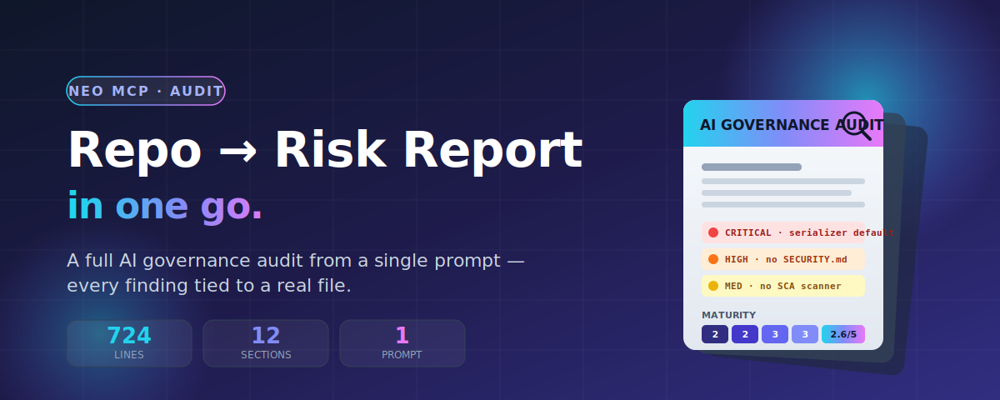
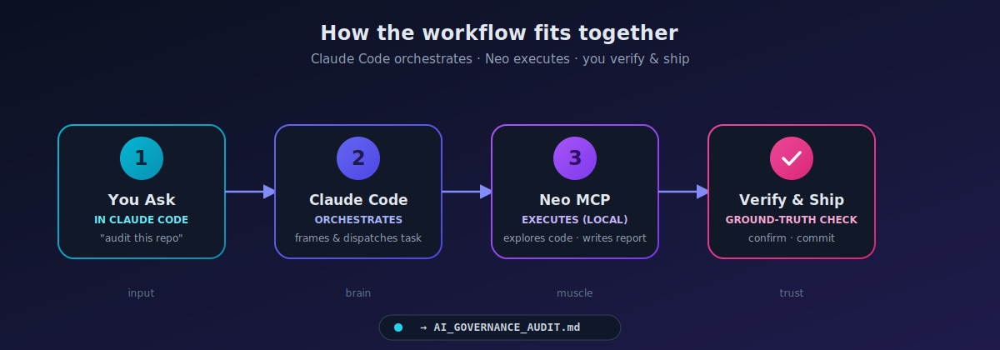

  

# From Repo to Risk Report: How Neo MCP Ran a Full AI Governance Audit in One Go

> We pointed Neo MCP at a real production codebase and asked for a complete AI governance audit. One prompt later, we had a 724-line, board-ready report — every finding tied to an actual file.

*A walkthrough of what came back, how it works, and how to wire Neo into Claude Code (or any agent) to do this yourself.*

**⏱ 6-min read · For:** engineering leads, AI risk owners, platform teams

---

## TL;DR

- We gave Neo MCP **one prompt**: "audit this repo for AI governance risk."
- It explored the codebase on its own — serializers, checkpointers, CI/CD, dependency config — and wrote a **12-section, evidence-based report**.
- Every finding points to a **real file path**, not a vibe.
- The pattern that makes it reliable: **Neo executes, an agent like Claude Code orchestrates and verifies.**

---

## The problem with AI governance audits

If you've ever sat through an AI governance review, you know the shape of the pain.

Someone has to read the codebase. Map the dependencies. Find where secrets live. Figure out how state is persisted. Check what the CI pipeline *actually* enforces. Then translate all of it into the language of risk — NIST AI RMF, ISO 42001, OECD principles, a maturity scorecard, an action plan.

It's days of work. It's expensive. And it almost always happens **after** something has already shipped.

So we ran an experiment:

> **Point Neo MCP at a real, non-trivial codebase and ask for a complete AI governance audit — in a single pass.**

The target: [`langchain-ai/langgraph`](https://github.com/langchain-ai/langgraph), the orchestration framework behind a huge number of production agent systems. A monorepo. Eight Python packages. Checkpointers, serializers, a release pipeline. Exactly the kind of system a governance team would actually have to assess.

---

## The setup: one prompt, one run

The entire input was a single structured prompt naming the twelve areas to assess:

| # | Area | # | Area |
|---|------|---|------|
| 1 | System Overview | 7 | Monitoring & Observability |
| 2 | Governance Framework | 8 | Compliance Readiness |
| 3 | AI Risk Assessment | 9 | Findings (Critical → Low) |
| 4 | Model Lifecycle | 10 | Recommendations |
| 5 | Data Governance | 11 | Maturity Scorecard (1–5) |
| 6 | Security Assessment | 12 | Final report |

We pointed Neo at the repository, submitted the task, and stepped back.

**No hand-holding. No "now go look at the serializer." Neo planned its own investigation.**

---

## What Neo actually did

This is the part that matters. Neo didn't summarize the README and call it a day. Watching its activity log, it:

- 🗂️ **Walked the monorepo** — mapped all eight Python libraries and the JS SDK, and how `checkpoint`, `prebuilt`, and `langgraph` depend on each other.
- 🔐 **Read the security-critical paths** — `JsonPlusSerializer`, `EncryptedSerializer`, the checkpoint base classes, the Pregel engine, the error taxonomy.
- ⚙️ **Inspected the release pipeline** — the PyPI publishing workflow and its attestation settings.
- 📋 **Hunted for governance artifacts** — SECURITY.md, CODE_OF_CONDUCT.md, CONTRIBUTING.md, a changelog, an `.env.example`.
- 📦 **Checked dependency hygiene** — the version pins in `pyproject.toml` and the Dependabot configuration.

Then it wrote a **724-line, evidence-based report** — with every finding tied to a concrete file path.

---

## What it found

A few highlights, each grounded in an actual repository artifact:

### 🔴 Permissive deserialization by default
`JsonPlusSerializer` carries a security warning *in its own docstring*: if an attacker can write to your checkpoint store, deserialization can trigger code execution. The hardening switch — `LANGGRAPH_STRICT_MSGPACK=true` — ships **off by default**. Neo flagged this as the single most significant concrete security risk in the codebase.

### 🟠 No security policy in the repo
No `SECURITY.md`. No documented disclosure process. No security contact. For a framework this widely deployed, that's a real gap.

### 🟠 Dependency automation, but no security scanning
Neo got the nuance right: Dependabot **is** configured (`.github/dependabot.yml`, 11 update scopes across the `github-actions` and `uv` ecosystems) — but there's **no SCA/SAST scanner** (CodeQL, Snyk, Trivy) in CI to catch known vulnerabilities in pinned dependencies.

### 🟡 Release attestations disabled
The publish workflow sets `attestations: false` with a "temp workaround" comment — so published artifacts aren't carrying provenance attestations.

### 🟡 No model lifecycle tooling
The framework offers the *infrastructure* (checkpoints, state) that could support lifecycle management — but implements none of it. No model registry, versioning, evaluation gates, or rollback semantics. All delegated downstream.

Neo rolled these into a **maturity scorecard**:

| Category | Score | Category | Score |
|----------|:-----:|----------|:-----:|
| Governance | 2 / 5 | Data Management | 3 / 5 |
| Risk Management | 2 / 5 | Model Management | 2 / 5 |
| Security | 3 / 5 | Monitoring | 3 / 5 |
| Documentation | 3 / 5 | | |

…plus a **four-phase, 18-item action plan** with owners and success criteria.

> That's not a toy output. That's the skeleton of a real engagement deliverable — from a single prompt.

---

## Under the hood: what makes Neo MCP different

Neo MCP isn't a chat wrapper. Three properties make it suited to this kind of work:

**🏠 It runs locally.** The Neo daemon executes on *your* machine and writes files directly into your workspace. Your code never leaves your environment. For a governance or security audit, that's not a nice-to-have — it's the whole point.

**🎯 It's task-oriented, not turn-oriented.** You hand it an objective — "audit this repo" — and it plans and executes a multi-step investigation. You don't spoon-feed each step.

**📄 It produces artifacts, not just answers.** The output is a file in your repo, ready to commit, review, and iterate on.

---

## How to use Neo MCP with Claude Code (or any agent)

The real unlock is using Neo *as a tool inside* an agent like Claude Code. The agent orchestrates; Neo does the heavy, autonomous, file-producing work.

  

**1. Connect Neo to your agent.**
Neo exposes an MCP server. In Claude Code, add it as an MCP integration so the agent can call Neo's tools (`neo_submit_task`, `neo_task_status`, `neo_get_messages`, `neo_send_feedback`).

**2. Drive it from your editor.**
No context-switching. You ask Claude to run the audit; Claude submits the task to Neo, polls for completion, and surfaces the result — all in the same conversation.

**3. Use the division of labor.**

| Role | Who | Strengths |
|------|-----|-----------|
| **Executor** | Neo | Long-running, autonomous, local, file-writing. "Go investigate this whole codebase and produce X." |
| **Orchestrator + reviewer** | Claude Code | Frames the task, integrates the result, and **checks the work.** |

**4. Write objective-level prompts.**
Neo rewards specificity at the *goal* level, not the *step* level. Don't tell it which files to open. Tell it:

> *"Perform a comprehensive AI governance audit of this repository. Cover system overview, governance, AI risk (with a matrix), model lifecycle, data governance, security, monitoring, and compliance readiness against NIST AI RMF / ISO 42001 / OECD. Produce a maturity scorecard and a prioritized action plan. Be evidence-based — reference file paths. Save it to `AI_GOVERNANCE_AUDIT.md`."*

That one paragraph is enough to produce the report above.

---

## Best practices

A few things that make this reliable rather than just impressive:

- ✅ **Verify against ground truth.** Repo-grounded claims ("this file has this setting") are easy to confirm and tend to be rock-solid. Externally-sourced claims deserve a citation check. Bake a verification step in — it turns "fast" into "trustworthy."
- 🎯 **Keep the workspace scoped.** Point Neo at the project root, not a subdirectory, so file references land in the right place.
- 👀 **Review the diff.** Treat the report like any other artifact: read it, sanity-check it, then act.
- 🔁 **Iterate with feedback, not restarts.** Need a section tightened? Send targeted feedback — Neo revises the existing artifact in place.
- 🛠️ **Use it where the work is real and tedious.** Governance audits, security sweeps, dependency analysis, migration planning — anything that's "read a lot, then write a structured deliverable."

---

## The takeaway

A complete, evidence-based AI governance audit of a real production framework — twelve sections, a risk matrix, a maturity scorecard, a prioritized action plan — generated from a single prompt and saved straight into the repo.

The interesting part isn't that an agent wrote a long document. It's that Neo did the **investigative** work — reading the actual security-critical code, checking the actual CI config, finding the actual missing files — and grounded every finding in something you can go verify yourself.

Pair that with an orchestrator like Claude Code, and days of manual review become minutes of autonomous work plus a focused verification pass.

> **The model for using Neo MCP well: let it do the heavy lifting, keep a human (or a second agent) in the loop to verify, and ship the artifact.**

---

### Try it yourself

Connect Neo MCP to your agent, point it at a repository, and ask for something real — an audit, a security sweep, a migration plan.

Then do the one thing that makes it bulletproof: **verify what it gives you.**
